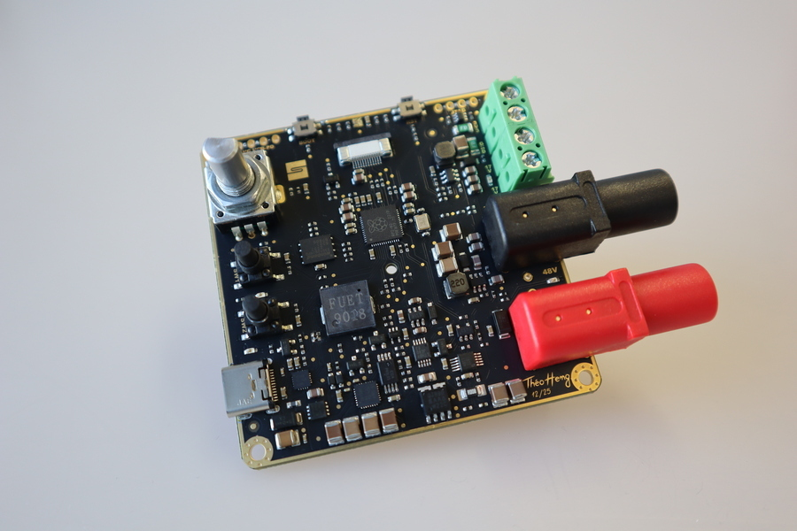
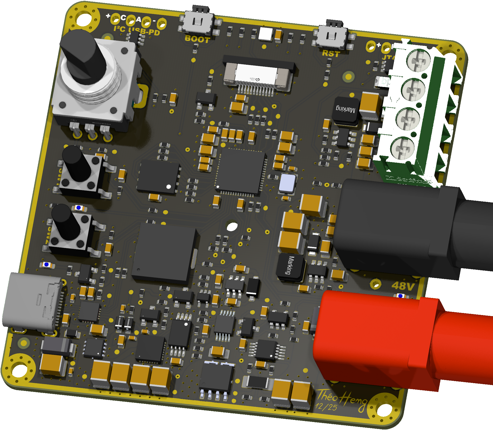
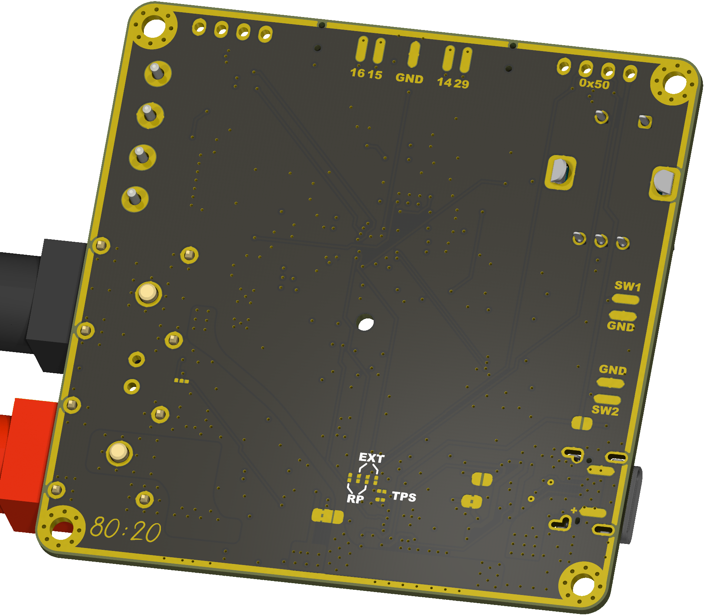

<p align="center" width="100%">
  
</p>

<h1 align="center">PD240W</h1>

<p align="center" width="100%">
    
</p>

***

<p align="center">
  
&nbsp; &nbsp; &nbsp; &nbsp;
  
</p>

***

## SPECIFICATIONS

| Parameter | Value | 
| --- | --- |
| Dimensions | 66.0 × 66.0 mm |
| Input Voltage | 5 - 53 V |
| Output Voltage | 3.3 - 48 V |
| Max. Output Current Voltage | 5 A |
| Max Power Output | 240 W |

***

## DIRECTORY STRUCTURE
```
  ├─ Images             # Pictures, renders, and annotated PCB images
  ├─ lib                # KiCad footprint and symbol libraries
  │  ├─ lib_fp          # Footprint libraries
  │  └─ lib_sym         # Symbol libraries
  ├─ Logos              # Project logos used in the PCB design package
  ├─ Manufacturing      # Assembly and fabrication deliverables
  │  ├─ Assembly        # BoM, placement, and assembly notes
  │  └─ Fabrication     # Fabrication exports and release bundles
  ├─ Schematic          # Exported schematic documentation
  └─ Templates          # KiCad title block templates
```