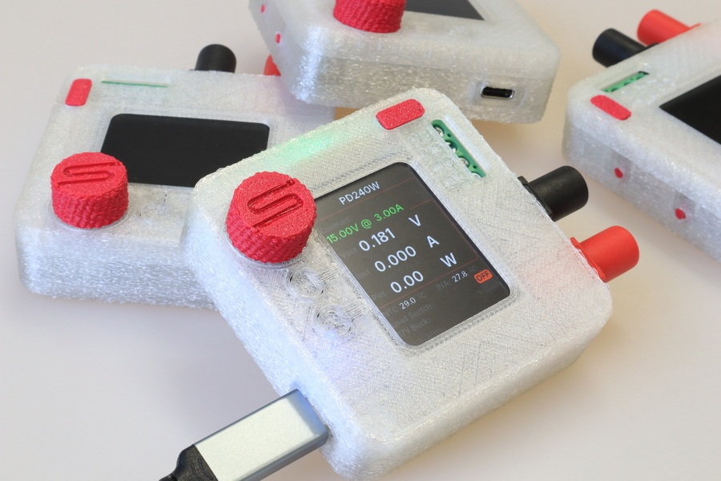
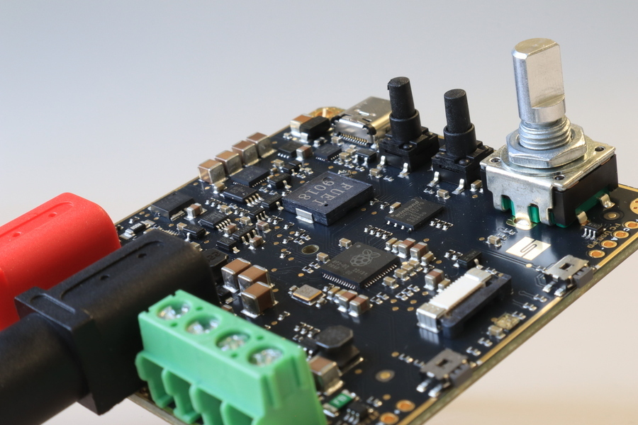
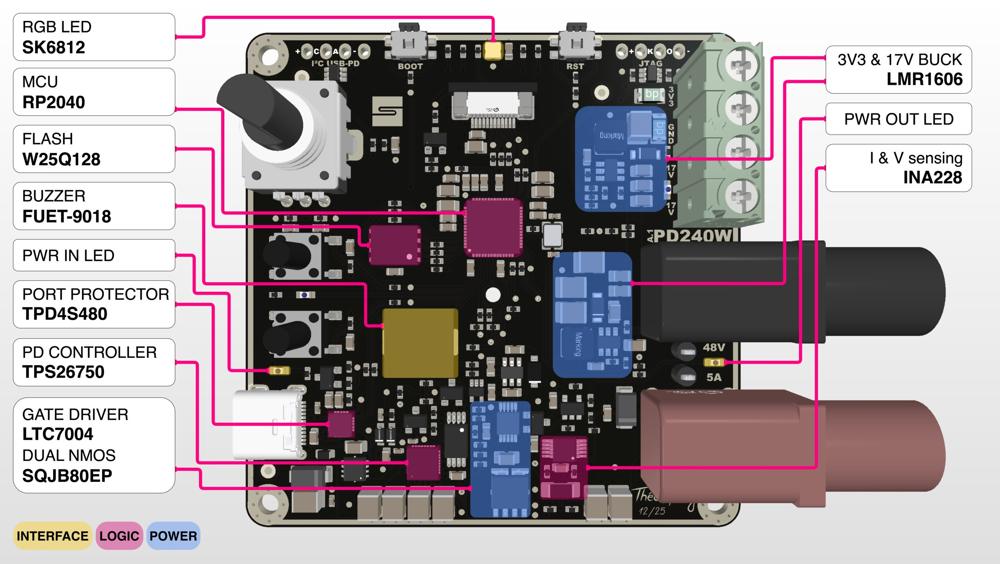
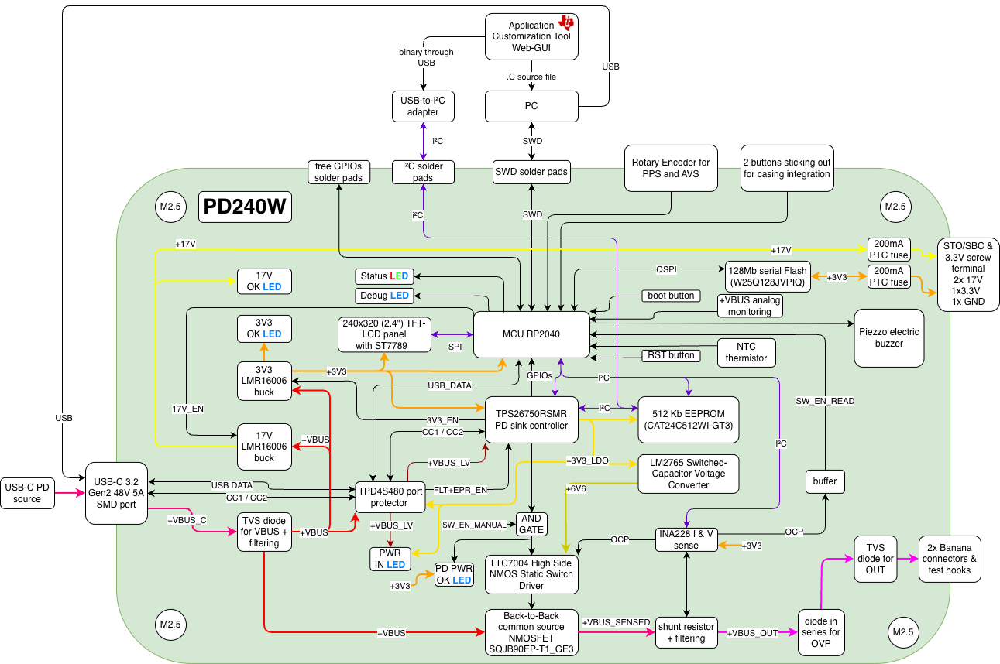
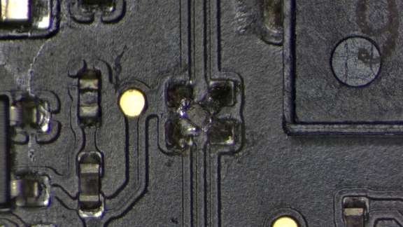
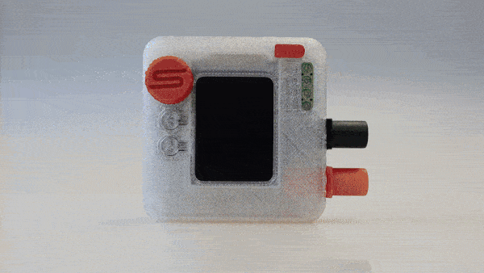
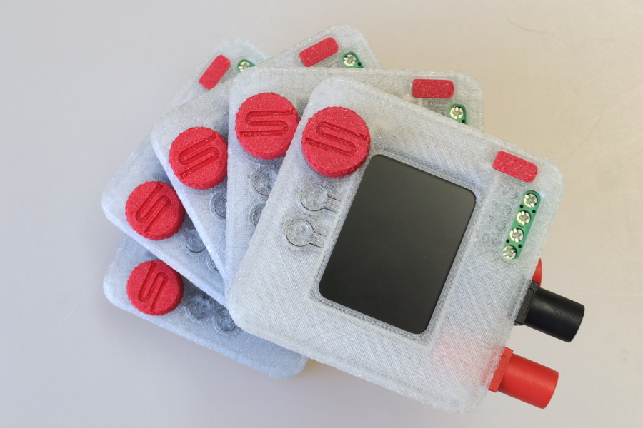
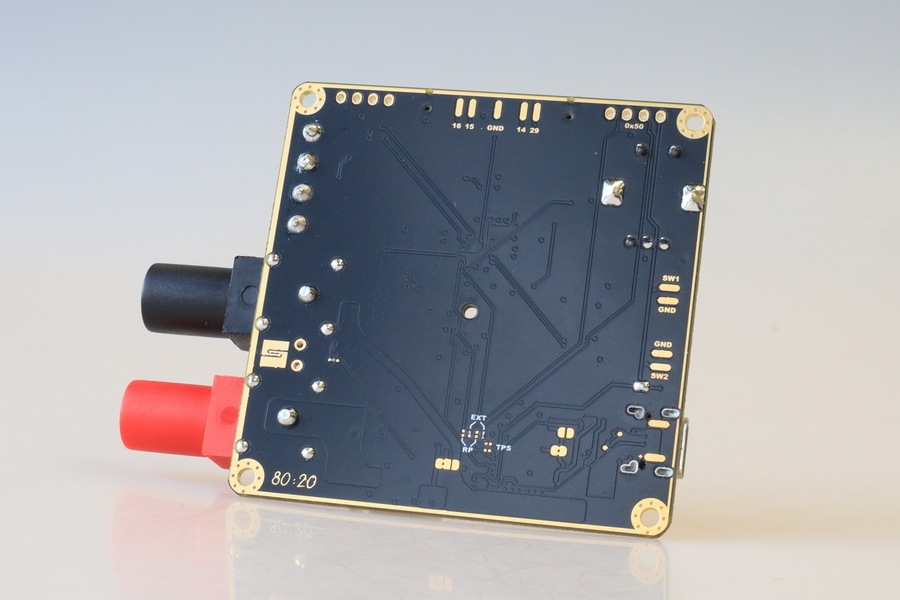

# PD240W

[](https://github.com/theohg/PD240W/releases/latest)


An adjustable power supply for motor drives using USB-C Power Delivery negotiation, supporting up to **240W at 48V 5A**. This device is designed to be compatible with USB-PD 3.1 and above. Firmware runs on a Raspberry Pi Pico ([RP2040](https://www.raspberrypi.com/products/rp2040/)).

Follow the latest project logs and updates on <a href="https://hackaday.io/project/205084-pd240w" target="_blank" title="PD240W on Hackaday.io">
Hackaday.io 
</a>

<p align="center">
  
</p>

> [!WARNING]
> **Disclaimer**: This device has currently only been tested for the **USB-PD 3.0** standard (up to 20V, including PPS). It has not yet been validated with the **USB-PD 3.1 ERP** extensions (28V, 36V, and 48V with AVS). Use at your own risk when testing high-voltage EPR profiles.

## Table of Contents

- [Features](#features)
- [Hardware](#hardware)
- [Quick Start](#quick-start)
- [Controls](#controls)
- [Firmware Structure](#firmware-structure)
- [Want one?](#want-one)
- [Planned Features](#planned-features)
- [Acknowledgements](#acknowledgements)

## Features

- **USB-C Power Delivery**: Negotiates Fixed, PPS (5-21V programmable), and AVS (15-48V EPR) profiles
- **Current Limiting**: Adjustable 50mA-5A via INA228 power monitor with hardware overcurrent protection
- **LCD Interface**: 240x320 ST7789 display with anti-aliased fonts and Prusa-style encoder navigation
- **Safety**: Overcurrent ISR, overtemperature monitoring (NTC + INA228)
- **Settings Persistence**: User settings stored in RP2040 flash with CRC32 validation
- **Auto PPS Tuning**: Closed-loop voltage correction for PPS charger output accuracy
- **Energy Monitoring**: Tracks mAh delivered since boot via INA228 charge accumulator
- **17V Buck Output**: Optional mock STO/SBC voltage for motor drive safety circuits
- **Configurable**: Brightness, auto-dim, startup melody, auto-output on boot and more

## Hardware

<p align="center">
  
  
</p>
<p align="center">
  
</p>
<p align="center">
  
</p>

| Type | Path | Contents |
|------|------|----------|
| PCB (STEP) | `3D_models/PD240W_PCB.stp` | Full PCB 3D model |
| Enclosure (STL) | `3D_models/enclosure/` | Casing top/bottom, knob, button, LCD support, SWD cover |
| Gerbers | `PCB_files/gerbers/` | PCB manufacturing files |
| BOM | `PCB_files/BOM.csv` | Bill of materials |
| Pick & Place | `PCB_files/pick_and_place.csv` | Pick and place file |

### Hardware Erata

USB data lines (D+/D-) are reversed in the current PCB revision, preventing native USB communication between the RP2040 and the USB host. This can be easily fixed by crossing the D+ and D- lines on the PCB by crossing the series 27Ω resistors as shown below:

<p align="center">
  
</p>

## Quick Start

### Flash Pre-built Firmware

1. Download `PD240W.uf2` from the [latest release](https://github.com/theohg/PD240W/releases/latest)
2. Hold **BOOTSEL** button on the Pico while connecting USB
3. Drag `PD240W.uf2` to the mounted `RPI-RP2` drive

### Build from Source

Requires: [Pico SDK 2.2.0](https://github.com/raspberrypi/pico-sdk), ARM GCC toolchain, CMake, Ninja

```bash
git clone https://github.com/theohg/PD240W.git
cd PD240W

mkdir -p build && cd build
cmake -G Ninja ..
ninja
```

The output binary is `build/PD240W.uf2`.

### Flash via SWD

```bash
openocd -f interface/cmsis-dap.cfg -f target/rp2040.cfg \
  -c "adapter speed 5000; program build/PD240W.elf verify reset exit"
```

> [!IMPORTANT]
> **EEPROM Initial Setup**: Before full PD negotiation can work, you must flash the **TPS26750 EEPROM** configuration. This is done via the **EEPROM Flash** workflow found in the **Settings** menu. 
> 
> **Note**: Before the EEPROM is flashed, the board will only power on when connected to a standard 5V non-PD charger (USB BC1.2 mode).

Once the firmware has been successfully flashed, connect the device to a compatible USB-PD power source and interact with the encoder and buttons to navigate the menus and adjust settings as explained below.

> [!NOTE]
> Finding a compact and affordable charger supporting **USB-PD 3.1** (up to 48V EPR) is currently quite rare. Here are a few known options:
>
> | Model | Max single-port PD Output | Voltage Profile | Approx. Price |
> |---|---|---|---|
> | **[UGREEN Nexode 140W](https://fr.ugreen.com/products/ugreen-nexode-140w-chargeur-usb-c-pd-3-1-3-ports)** | 140W | 28V @ 5A | ~60€ |
> | **[Framework Power Adapter - 180W](https://frame.work/fr/fr/products/16-power-adapter?v=FRANCR000F)** | 180W | 36V @ 5A | ~109€ |
> | **[HKY 240W GaN Charger](https://www.amazon.de/-/en/Charger-Framework-Thunderbolt-External-ADP-240KB/dp/B0FLXY1HYW/ref=sr_1_2?crid=3N3IPHZQ5LLC7&dib=eyJ2IjoiMSJ9.Hby-yLg1Ti0JNivqvDzvN57zIH6zG4_c9wlyL50Z52GmOPyP_vKubcMJ3zNZ7RRcIgOo2FKgZio1hprqALfRdOTl2DQ7Dp27o4l66qmaDQw9ctSuX0EaWnDfyVwVAMaSwnUP7h1NBuraYlZnAgiljw.9cbe3P4mLf8D7-0faSCcJpKki5cfrjZLwFO-zW9XlJw&dib_tag=se&keywords=hky+240w&qid=1769454134&sprefix=hky+240w%2Caps%2C102&sr=8-2)** | 240W | 48V @ 5A | ~90€ |
> | **[Framework Power Adapter - 240W](https://frame.work/fr/fr/products/power-adapter-240w?v=FRAKMX000F)** | 240W | 48V @ 5A | ~120€ |
> | **[UGREEN NEXODE 500W](https://eu.ugreen.com/products/ugreen-nexode-500w-6-port-gan-desktop-fast-charger)** | 240W | 48V @ 5A | ~250€ |

## Controls

| Input | Action |
|-------|--------|
| Encoder Rotate | Navigate menus / Adjust values |
| Encoder Click | Confirm / Select |
| BTN1 (top) | Toggle load switch output |
| BTN2 (bottom) | Toggle 17V buck (requires VBUS > 18V) |

<p align="center">
  
</p>

### Menu Structure


| Menu Item | Description |
|-----------|-------------|
| Select Voltage | Fixed / PPS / AVS PDO selection |
| Current Limit | 50mA - 5A, 50mA steps with encoder acceleration |
| Flash EEPROM | TPS26750 configuration flash workflow |
| Auto PPS Tuning | Closed-loop voltage correction (ON/OFF) |
| Auto Output | Enable load switch on boot (ON/OFF) |
| Brightness | LCD backlight 5-100% |
| Dim Timeout | Auto-dim after 1-10 min inactivity |
| Startup Melody | Silent / Mario / Chime / TwoTone |
| Sounds | Navigation beeps (ON/OFF) |

## Firmware Structure

```
src/
├── main.cpp                        Entry point, non-blocking main event loop
├── hardware.h/cpp                  Hardware singleton aggregating all drivers
├── interrupts.h/cpp                Centralized GPIO interrupt router (RP2040 single-callback)
│
├── config/
│   ├── board_config.h              Pin definitions (Board:: namespace)
│   ├── app_config.h                Timeouts, thresholds, limits (AppConfig:: namespace)
│   └── version.h                   Firmware & hardware version, author...
│
├── drivers/                        Low-level hardware drivers (no business logic)
│   ├── display/
│   │   ├── st7789.h/cpp            SPI LCD driver with AA font rendering
│   │   ├── aa_font.h               Anti-aliased font data structure
│   │   └── font_inter_*.h          Generated Inter font bitmaps (14/20/28px)
│   ├── power/
│   │   ├── ina228/                 Power monitor: voltage, current, power, temperature
│   │   └── tps26750/               USB-PD controller: PDO discovery, contract negotiation
│   ├── input/
│   │   ├── rotary_enc.h/cpp        Quadrature encoder with velocity tracking
│   │   ├── button.h/cpp            Debounced button with click/long-press
│   │   └── adc_inputs.h/cpp        VBUS voltage + NTC temperature (ADC channels)
│   ├── gpio/                       SimpleIO: digital output with non-blocking blink
│   ├── buzzer/                     PWM buzzer with melody playback
│   └── rgb_led/                    SK6812 via PIO state machine
│
├── logic/                          Application logic
│   ├── state_machine.h/cpp         BOOT -> MAIN <-> MENU <-> ADJUST, FAULT handling
│   ├── safety.h/cpp                Temperature/voltage/current monitoring, fault triggers
│   ├── pd_manager.h/cpp            PD contract caching, PPS keep-alive, auto-tuning
│   ├── settings.h/cpp              Flash persistence with CRC32, debounced saves
│   └── tps_eeprom_workflow.h/cpp   TPS26750 EEPROM compare/flash state machine
│
├── ui/
│   ├── display_manager.h/cpp       All screen rendering (boot, main, menu, adjust, fault)
│   ├── font_config.h               Central font size mapping (FONT_LARGE/MEDIUM/SMALL)
│   └── assets/synapticon_logo.h    Boot screen logo bitmap
│
├── utils/
│   ├── logging.h                   LOG_INFO/WARN/ERROR/DEBUG/CRITICAL macros
│   ├── tps_eeprom_loader.h/cpp     Low-level TPS26750 EEPROM read/write
│   └── tps26750_patch.c            TPS26750 binary configuration blob
│
└── tools/
    ├── generate_font.py            Font bitmap generator (Python + Pillow)
    └── fonts/                      Source TTF files (Inter)
```

## Want one?

<p align="center">
  
</p>

Feel free to order assembled PCBs, flash the firmware, and test it for yourself! Manufacturing 5 assembled PCBs will cost approximately **$415**. 

The project is open for contributions. Don't hesitate to improve the code, report bugs, or suggest new features via Pull Requests and Issues!

## License and Copyright

This repository contains different types of source files, which are licensed as follows:

### 1. Hardware files (CC BY-NC 4.0)
All hardware design files in the PCB_files directory (Schematics, PCB layout, Gerbers, BOM) and 3D printable enclosure files are licensed under the **Creative Commons Attribution-NonCommercial 4.0 International License**. 

You are free to download, modify, and build this board for personal, educational, and hobbyist use. However, you may **not** use these designs for commercial purposes (such as manufacturing and selling the boards) without prior written permission.

Please see the [LICENSE.txt](./LICENSE.txt) file for full terms.

### 2. Firmware & Software (MIT License)
The firmware and software source code in this repository is licensed under the **MIT License**. 

You are free to use, modify, and distribute the software component of this project. 

Please see the [LICENSE-FIRMWARE.txt](./LICENSE-FIRMWARE.txt) file for full terms.

## Planned Features for V1.1.0+

- **Full USB-PD 3.1/3.2 Support**: Stable support for the entire norm, including AVS and EPR profiles.
- **Auto AVS Tuning**: Closed-loop voltage correction for AVS profiles (similar to current PPS tuning).
- **Extended PPS Range**: Support for PPS voltages as low as 3.5V.

## Acknowledgements

This project was made possible by [Synapticon GmbH](https://www.synapticon.com), who funded and supported its development. Thank you for providing the resources, hardware, and opportunity to bring PD240W to life.

Inspiration for this project was taken from the great work on portable USB-C PD power supplies by CentyLab on the [PocketPD](https://hackaday.io/project/194295-pocketpd-usb-c-portable-bench-power-supply) project and Alex Xia with his [ProtoV MINI](https://hackaday.io/project/204461-protov-mini-tiny-usb-c-breadboard-power-supply).

***

<p align="center">
  
</p>

Made with ❤️ by Théo Heng