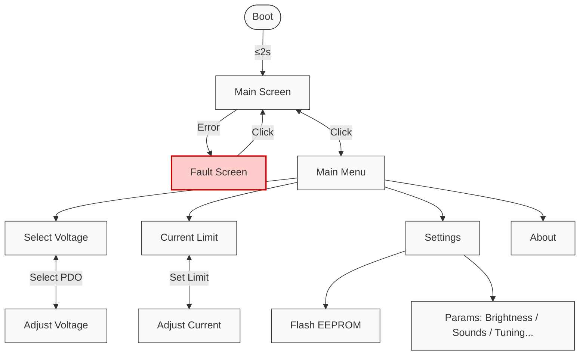

# PD240W

[](https://github.com/theohg/PD240W/releases/latest)


An adjustable power supply for motor drives using USB-C Power Delivery negotiation, supporting up to **240W at 48V 5A**. Firmware runs on a Raspberry Pi Pico (RP2040).

<p align="center">
  
</p>

## Features

- **USB-C Power Delivery**: Negotiates Fixed, PPS (5-21V programmable), and AVS (15-48V EPR) profiles
- **Current Limiting**: Adjustable 50mA-5A via INA228 power monitor with hardware overcurrent protection
- **LCD Interface**: 240x320 ST7789 display with anti-aliased fonts and Prusa-style encoder navigation
- **Safety**: Overcurrent ISR, overtemperature monitoring (NTC + INA228)
- **Settings Persistence**: User settings stored in RP2040 flash with CRC32 validation
- **Auto PPS Tuning**: Closed-loop voltage correction for PPS charger output accuracy
- **Energy Monitoring**: Tracks mAh delivered since boot via INA228 charge accumulator
- **17V Buck Output**: Optional STO/SBC voltage for motor drive safety circuits
- **Configurable**: Brightness, auto-dim, startup melody, auto-output on boot

## Hardware

<p align="center">
  
  
</p>

| Component | Part | Specification |
|-----------|------|---------------|
| MCU | Raspberry Pi Pico (RP2040) | Dual Cortex-M0+, 264KB SRAM |
| USB-C PD Controller | TI TPS26750 | I2C 0x21, USB PD 3.1 with EPR |
| Current Sensor | TI INA228 | I2C 0x40, 8mOhm shunt, 20-bit |
| Display | ST7789 | 240x320 2.4" SPI @ 10MHz |
| RGB LED | SK6812 | PIO driven, GRB color order |
| Input | Rotary encoder + 2 buttons | ISR-based with debounce |
| Buzzer | PWM driven | Configurable melodies |
| Max Output | | 48V @ 5A (240W) |

### Hardware Files

| Type | Path | Contents |
|------|------|----------|
| PCB (STEP) | `3D_models/PD240W_PCB.stp` | Full PCB 3D model |
| Enclosure (STL) | `3D_models/enclosure/` | Casing top/bottom, knob, button, LCD support, SWD cover |
| Gerbers | `PCB_files/gerbers/` | PCB manufacturing files |
| BOM | `PCB_files/BOM.csv` | Bill of materials |

### Pin Map

| Bus | Pins | Peripherals |
|-----|------|-------------|
| I2C0 @ 400kHz | GP4/GP5 | INA228, TPS26750 |
| I2C1 @ 400kHz | GP14/GP15 | CAT24C512 EEPROM (TPS26750 config) |
| SPI | GP18-GP21 | ST7789 LCD |
| UART @ 115200 | GP16 TX / GP29 RX | Debug serial output |
| PWM | GP24 | LCD backlight |
| PIO | GP28 | SK6812 RGB LED |

## Quick Start

### Flash Pre-built Firmware

1. Download `PD240W.uf2` from the [latest release](https://github.com/theohg/PD240W/releases/latest)
2. Hold **BOOTSEL** button on the Pico while connecting USB
3. Drag `PD240W.uf2` to the mounted `RPI-RP2` drive

### Build from Source

Requires: [Pico SDK 2.2.0](https://github.com/raspberrypi/pico-sdk), ARM GCC toolchain, CMake, Ninja

```bash
git clone https://github.com/theohg/PD240W.git
cd PD240W

mkdir -p build && cd build
cmake -G Ninja ..
ninja
```

The output binary is `build/PD240W.uf2`.

### Flash via SWD

```bash
openocd -f interface/cmsis-dap.cfg -f target/rp2040.cfg \
  -c "adapter speed 5000; program build/PD240W.elf verify reset exit"
```

## Controls

| Input | Action |
|-------|--------|
| Encoder Rotate | Navigate menus / Adjust values |
| Encoder Click | Confirm / Select |
| Encoder Long Press | Go Back / Exit current screen |
| BTN1 | Toggle load switch output |
| BTN2 | Toggle 17V buck (requires VBUS > 18V) |

<p align="center">
  
</p>

### Menu Structure



| Menu Item | Description |
|-----------|-------------|
| Select Voltage | Fixed / PPS / AVS PDO selection |
| Current Limit | 50mA - 5A, 50mA steps with encoder acceleration |
| Flash EEPROM | TPS26750 configuration flash workflow |
| Auto PPS Tuning | Closed-loop voltage correction (ON/OFF) |
| Auto Output | Enable load switch on boot (ON/OFF) |
| Brightness | LCD backlight 5-100% |
| Dim Timeout | Auto-dim after 1-10 min inactivity |
| Startup Melody | Silent / Mario / Chime / TwoTone |
| Sounds | Navigation beeps (ON/OFF) |

## Project Structure

```
src/
├── main.cpp                        Entry point, non-blocking main event loop
├── hardware.h/cpp                  Hardware singleton aggregating all drivers
├── interrupts.h/cpp                Centralized GPIO interrupt router (RP2040 single-callback)
│
├── config/
│   ├── board_config.h              Pin definitions (Board:: namespace)
│   ├── app_config.h                Timeouts, thresholds, limits (AppConfig:: namespace)
│   └── version.h                   Firmware & hardware version, author...
│
├── drivers/                        Low-level hardware drivers (no business logic)
│   ├── display/
│   │   ├── st7789.h/cpp            SPI LCD driver with AA font rendering
│   │   ├── aa_font.h               Anti-aliased font data structure
│   │   └── font_inter_*.h          Generated Inter font bitmaps (14/20/28px)
│   ├── power/
│   │   ├── ina228/                 Power monitor: voltage, current, power, temperature
│   │   └── tps26750/               USB-PD controller: PDO discovery, contract negotiation
│   ├── input/
│   │   ├── rotary_enc.h/cpp        Quadrature encoder with velocity tracking
│   │   ├── button.h/cpp            Debounced button with click/long-press
│   │   └── adc_inputs.h/cpp        VBUS voltage + NTC temperature (ADC channels)
│   ├── gpio/                       SimpleIO: digital output with non-blocking blink
│   ├── buzzer/                     PWM buzzer with melody playback
│   └── rgb_led/                    SK6812 via PIO state machine
│
├── logic/                          Application logic
│   ├── state_machine.h/cpp         BOOT -> MAIN <-> MENU <-> ADJUST, FAULT handling
│   ├── safety.h/cpp                Temperature/voltage/current monitoring, fault triggers
│   ├── pd_manager.h/cpp            PD contract caching, PPS keep-alive, auto-tuning
│   ├── settings.h/cpp              Flash persistence with CRC32, debounced saves
│   └── tps_eeprom_workflow.h/cpp   TPS26750 EEPROM compare/flash state machine
│
├── ui/
│   ├── display_manager.h/cpp       All screen rendering (boot, main, menu, adjust, fault)
│   ├── font_config.h               Central font size mapping (FONT_LARGE/MEDIUM/SMALL)
│   └── assets/synapticon_logo.h    Boot screen logo bitmap
│
├── utils/
│   ├── logging.h                   LOG_INFO/WARN/ERROR/DEBUG/CRITICAL macros
│   ├── tps_eeprom_loader.h/cpp     Low-level TPS26750 EEPROM read/write
│   └── tps26750_patch.c            TPS26750 binary configuration blob
│
└── tools/
    ├── generate_font.py            Font bitmap generator (Python + Pillow)
    └── fonts/                      Source TTF files (Inter)
```

<p align="center">
  
</p>

## Author

**Theo Heng** - [Synapticon GmbH](https://www.synapticon.com)

## Acknowledgements

This project was made possible by [Synapticon GmbH](https://www.synapticon.com), who funded and supported its development. Thank you for providing the resources, hardware, and opportunity to bring PD240W to life.
